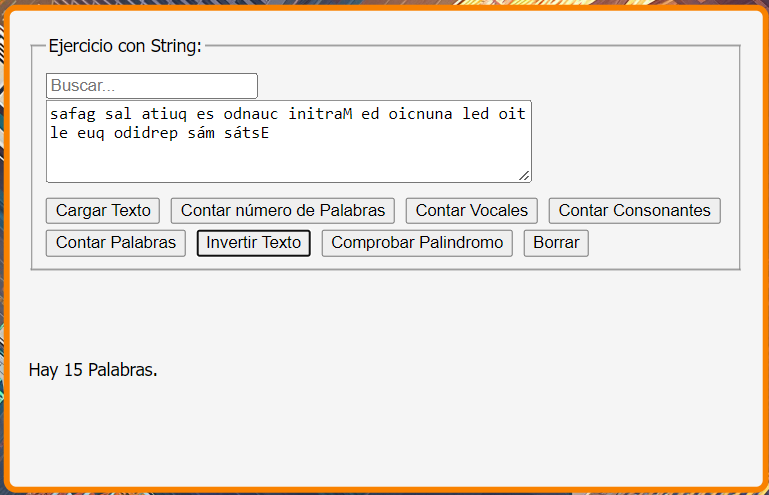

# analizador-string

Aplicación que genera texto a través de una API, cuenta las palabras, las consonantes, las vocales y las palabras introducidas en el buscador y comprueba si es un palíndromo, Realizada en JavaSript y estilos con CSS.
 
## Contenidos
 
1. [Capturas de pantalla](#capturas-de-pantalla)
2. [Tecnologías utilizadas](#tecnologías-utilizadas)
3. [Créditos](#créditos)
 
## Capturas de pantalla
Inicio de la Aplicaciíon.

Cargar de un texto aleatorio desde una API.

Cuenta el número de veces que se repite una palabra introducida por en el buscador.

Cuenta el número de vocales.

Cuenta el número de consonantes.

Cuenta el número de palabras que hay en el String.

Invierte el texto introducido

Comprueba si es un palíndromo.

 
 
## Tecnologías utilizadas
 
- JavaScript
- HTLM
- CSS

 
## Créditos
 
Este proyecto fue desarrollado por [Ángel Daniel](https://github.com/AngelDanielRuizMontes/).
